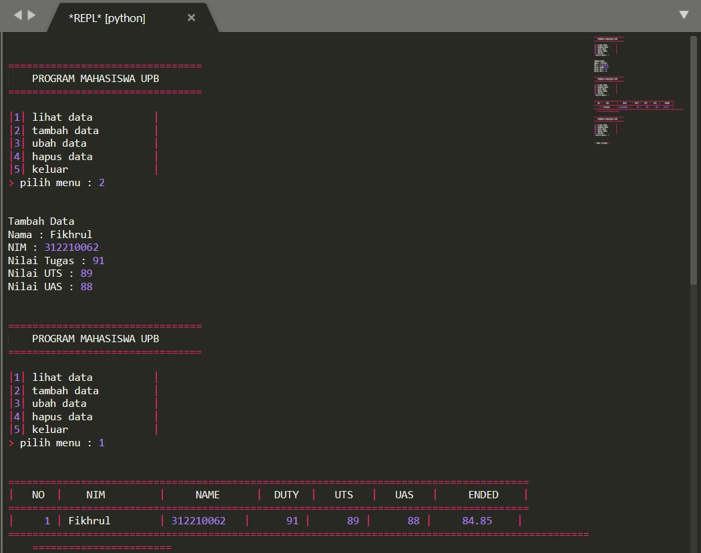
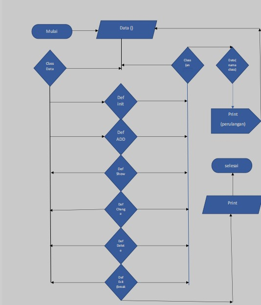

# Lab8

## Penjelasan

- Kita tulis Code
```
data = {}
```
- Kemudian kita tambahkan Class
```
class Data():
```
- Masukkan Syntax Code Buat Pilihan
```
def __init__(self,data1,data2,data3,data4,data5,data6):
        while True:

            print("\n")
            print("================================")
            print("    PROGRAM MAHASISWA UPB       ")
            print("================================\n")

            print("|1| lihat data          |")
            print("|2| tambah data         |")
            print("|3| ubah data           |")
            print("|4| hapus data          |")
            print("|5| keluar              |")

            x = input("> pilih menu : ")

            print("\n")

            if x == '1':
                self.Tampilkan()
            elif x == '2':
                self.Tambah()
            elif x == '3':
                self.Ubah()
            elif x == '4':
                self.Hapus()
                break 

            else:

                exit()
```
- Kemudian Tulislah code, untuk menambahkan data
```
def Tambah(self):
        print("Tambah Data")
        self.nama   = input('Nama : ')
        self.nim    = input('NIM : ')
        self.tugas  = int(input('Nilai Tugas : '))
        self.uts    = int(input('Nilai UTS : '))
        self.uas    = int(input('Nilai UAS : '))
        self.akhir = (self.tugas *30/100) + (self.uts *35/100) + (self.uas *30/100)
        data[self.nama] = self.nim, self.tugas, self.uts, self.uas, self.akhir
```
- Jangan lupa untuk Menampilkan Mahasiswa

```
class Mahasiswa(Data):
```
- Tulis code Tampilkan, untuk menampilkan data
```
def Tampilkan(self):
        if data.items():
            print("======================================================================================")
            print("|   NO  |    NIM         |     NAME      |  DUTY  |   UTS   |   UAS   |     ENDED    |")
            print("======================================================================================")
            i = 0 
            for a in data.items():
                i += 1
                print("|    {no:2d} | {0:14s} | {1:11s} | {2:7d} | {3:7d} | {4:7d} |    {5:6.2f}    |".format (a[0][: 14],a[1][0],a[1][1],a[1][2],a[1][3],a[1][4], no = i))
                print("=======================================================================================================================")
```
- Tulis code Ubah, untuk mengubah
```
def Ubah(self):
        print("Ubah Data")
        self.nama = input("Masukkan Nama Anda : ")
        if self.nama in data.keys():
            self.nim = input("NIM : ")
            self.tugas = int(input("Nilai Tugas : "))
            self.uts = int(input("Nilai UTS : "))
            self.uas = int(input("Nilai UAS : "))
            self.akhir = (self.tugas * 40/100) + (self.uts * 35/100) + (self.uas * 30/100)
            data[self.nama] = self.nim, self.tugas, self.uts, self.uas, self.akhir
        else:
            print("Nama Anda Tidak Ditemukan!")
```
- Tulis code Hapus, untuk menghapus data
``` 
def Hapus(self):
        print("Hapus Data?")
        self.nama = input("Masukkan Nama Anda : ")

        if self.nama in data.keys():
            del data[self.nama]
        else:
            print("Nama Anda Tidak Ditemukan!")
```
- Kemudian yang terakhir ketika kita ingin memanggil class kita hanya cukup menggunakan atau menambahkan 1 variabel sebagai dorongan class beserta fungsi
```
datamhs = Mahasiswa("data1","data2","data3","data4","data5","data6")
```
### Gambar


### Flowchart

